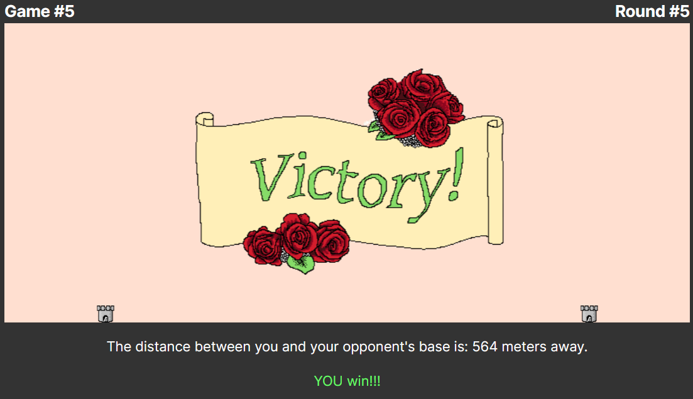

# React Artillery
<div align="center">
  
</div>

--- 

### 📖 Description
This is a remake of a former student project, which was a text-only console version of the game Artillery, which you can find [here](https://github.com/Cruduper/Artillery-Java141). I decided I wanted to port it over to Javascript and create a UI with simple graphics and animations.   
<br><br/> 

### 🛠 Technologies Used

* _React_
* _JavaScript_
* _konva_
* _HTML_
* _sass_
* _eslint_
* _npm_
<br><br/>

### 🦠 Known Bugs OR Issues

...work in progress...
<br><br/>

### ⏳ To-Do List

* _add randomly generated terrain_
* _add more robust 2-dimensional hit detection (necessary for randomly generated terrain)_
* _add wind_
<br><br/>

### 🔧 Setup/Installation

##### Installing this entire repo
* _clone git repository to a local machine_
* _navigate to root folder of the project using command line_
* _use the '$ npm install' command to install necessary packages_
* _type in '$ npm run build' to build project_
* _type in '$ npm run dev' command to open project in browser and start live server_
* _have a great time all the time!_

##### Copying component to an existing Project
* _...work in progress..._
* _have an excellent rest of your day!_


## ⚖️ License

[LINK](https://opensource.org/licenses/MIT)    

```
MIT License
Permission is hereby granted, free of charge, to any person obtaining a copy
of this software and associated documentation files (the "Software"), to deal
in the Software without restriction, including without limitation the rights
to use, copy, modify, merge, publish, distribute, sublicense, and/or sell
copies of the Software, and to permit persons to whom the Software is
furnished to do so, subject to the following conditions:
The above copyright notice and this permission notice shall be included in all
copies or substantial portions of the Software.
THE SOFTWARE IS PROVIDED "AS IS", WITHOUT WARRANTY OF ANY KIND, EXPRESS OR
IMPLIED, INCLUDING BUT NOT LIMITED TO THE WARRANTIES OF MERCHANTABILITY,
FITNESS FOR A PARTICULAR PURPOSE AND NONINFRINGEMENT. IN NO EVENT SHALL THE
AUTHORS OR COPYRIGHT HOLDERS BE LIABLE FOR ANY CLAIM, DAMAGES OR OTHER
LIABILITY, WHETHER IN AN ACTION OF CONTRACT, TORT OR OTHERWISE, ARISING FROM,
OUT OF OR IN CONNECTION WITH THE SOFTWARE OR THE USE OR OTHER DEALINGS IN THE
SOFTWARE.
```
If you have any issues, questions, or canned fish recommendations, send me a message!    
Copyright (c) _2024_  _Eric Crudup_

<center><a href="#">Return to Top</a></center>
